# AWS アカウント構成
本プロジェクトで使用する AWS アカウントと目的は以下の通り。  

|AWS アカウント|目的|
|---|---|
|111111111111|○○システム 本番環境|
|222222222222|○○システム 検証環境|
|777777777777|セキュリティコントロール|
|888888888888|ログ集約|
|999999999999|管制塔|

## 要件

## セキュリティコントロール
セキュリティ関連サービスの出力やログを集中管理するためのアカウント。  
セキュリティイベントの表示や通知、フォレンジック調査の用途で使用する。  

## ログ集約
各 AWS アカウント上のリソースから出力されるログを集約するアカウント。  
分析、表示、保管の用途で使用する。  

## 管制塔
本プロジェクトでは複数の AWS アカウントを有している。  
AWS アカウントごとに IAM ユーザーを発行することはセキュリティ上のリスクがあるため、これを回避する目的で管制塔アカウントを使用する。  

プログラムアクセスを除く IAM ユーザーは全て管制塔アカウントに作成する。  
各システム用 AWS アカウントでの操作は、各アカウントの IAM ロールへスイッチした後に行う。  
  

